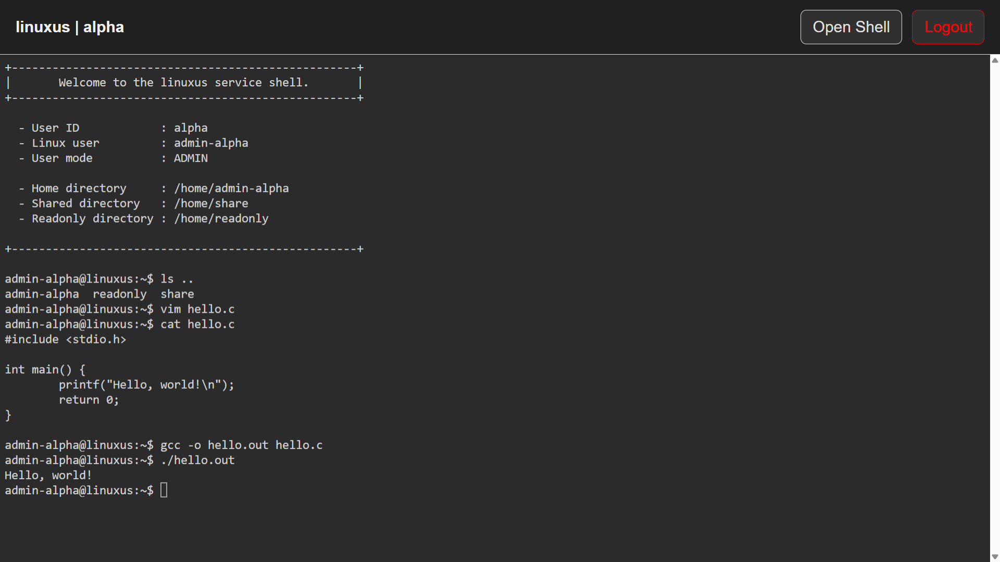

# LINUXUS

> Linuxus, a Docker-based service that provides Ubuntu shell environments via a web browser for Linux education

---

## 🌐 Preview

> 
> 

> 
>

---

## 🚀 Usage

0. Clone repository:

   ```bash
   git clone https://github.com/elecbug/linuxus
   cd linuxus
   ```

1. Install required dependencies:

   * Docker (required)
   * Go (only required for building the hash generator)

   ```bash
   # Install Go (optional, only needed for hash generator)
   sudo snap install go --classic
   ```

   ```bash
   # Install Docker
   ./util/docker_reinstall.sh
   ```

2. Build the hash generator:

   ```bash
   ./util/make_hash/build.sh
   ```

   This will generate the following executable:

   ```bash
   ./util/make_hash.out --help
   ```

3. Add the authentication file:

   ```bash
   mkdir -p ./src/data
   touch ./src/data/AUTH_LIST
   ```

4. Create user accounts by appending credentials using:

   ```bash
   ./util/make_hash.out <ID> <PASSWORD> >> ./src/data/AUTH_LIST
   ```

   > ⚠️ The default admin account ID is `alpha`.
   > You can change it by modifying `ADMIN_USER_ID` in `src/config.env`.

   ```bash
   ...
   ADMIN_USER_ID=alpha
   ...
   ```

5. Start the services (containers) for each user:

   ```bash
   ./util/simple_build_and_run.sh <OPTION>
   ```

   **⚙️ Options**

   The following options control container behavior:

   | Option                 | Description                 |
   |------------------------|-----------------------------|
   | `--generate`, `-g`     | Generate compose file       |
   | `--up`, `-u`           | Start all user containers   |
   | `--down`, `-d`         | Stop all user containers    |
   | `--restart`, `-r`      | Restart all user containers |
   | `--volume-clean`, `-v` | Reset all user directories  |

6. After running the services, a `./src/volumes` directory will be created automatically.

   Inside this directory (automatically managed by Linuxus):

   * User directories are located under the `homes` folder.
   * A shared directory (`share`) will be created.
   * A read-only directory (`readonly`) will be created.

   **Directory Structure**

   ```
   ./src/volumes/
   ├── homes/
   │   ├── <USER1>/
   │   ├── <USER2>/
   │   └── ...
   ├── share/
   └── readonly/
   ```

   **Directory Permissions**

   * **User directories (`homes/<USER>`)**

     * Accessible only by the corresponding user.
     * Mounted to `/home/<USER>` inside each container.

   * **`share` directory**

     * Accessible by all users.
     * Read, write, and execute permissions are allowed.
     * Mounted to `/home/share` inside each container.

   * **`readonly` directory**

     * Read and execute permissions for all users.
     * **Write access is restricted to the admin account only**.
     * Mounted to `/home/readonly` inside each container.

---

## 📄 License

This project is licensed under the [MIT License](./LICENSE).

---

## 🌱 Open Source & Contributions

Linuxus is an open-source project, and contributions are welcome.

- Report bugs, request features, or ask questions via Issues
- Submit pull requests following the contribution guidelines
- See [CONTRIBUTING.md](./CONTRIBUTING.md) for details on PR types and workflow
- Please follow the [Code of Conduct](./CODE_OF_CONDUCT.md)

---

## 🔐 Security

If you discover a security vulnerability, **do not open a public issue**.

Please refer to [SECURITY.md](./SECURITY.md) for responsible disclosure instructions.

---

## 🚧 Upcoming Features

The following features are currently under development:

- Runtime sign-up system (account creation without service restart)

More updates will be added in future releases.
