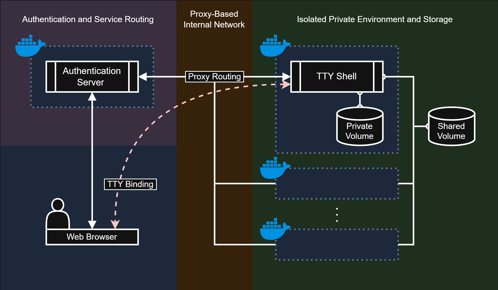
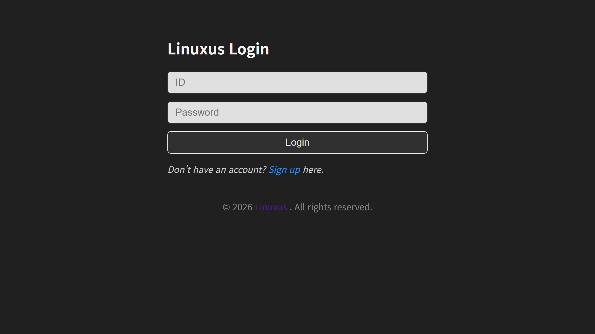
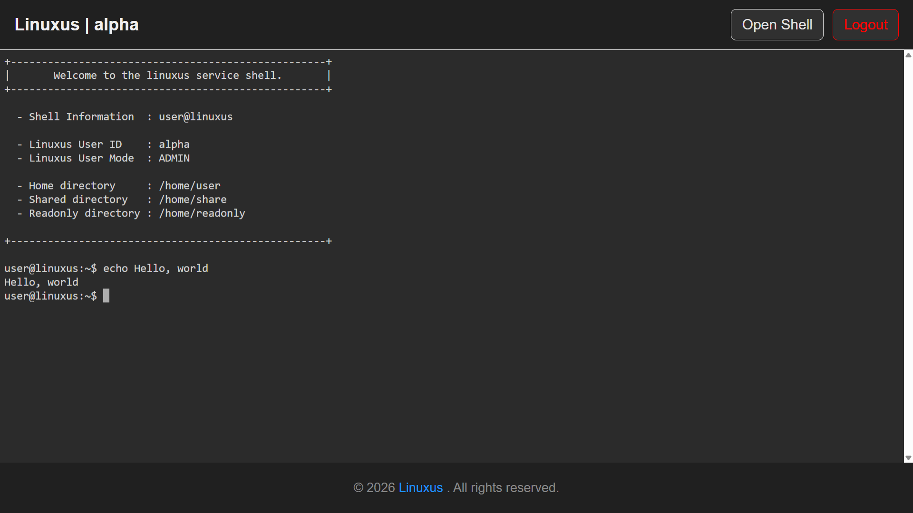
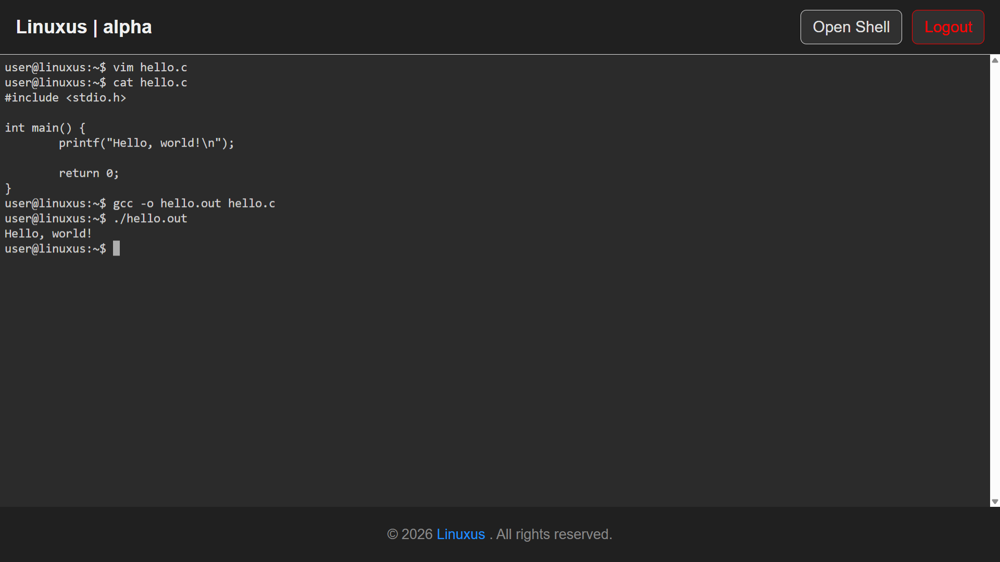

# 🚀 Usage

## 0. Clone Repository

Clone the repository from GitHub:

```bash
git clone https://github.com/elecbug/linuxus
cd linuxus
```

---

## 1. Install Dependencies

Install required packages:

### Go

```bash
sudo snap install go --classic
```

### Docker

```bash
sudo apt install -y docker-ce docker-ce-cli containerd.io docker-buildx-plugin docker-compose-plugin
```

---

## 2. Setup Authentication

### 2.1 Build Hash Generator

```bash
./util/make_hash/build.sh
```

Generated executable:

```bash
./util/make_hash.out --help
```

---

### 2.2 Create Authentication File

```bash
mkdir -p data
touch data/AUTH_LIST
```

---

### 2.3 Add Users

```bash
./util/make_hash.out <ID> <PASSWORD> >> data/AUTH_LIST
```

---

### 2.4 Admin Account

* Default admin ID: `alpha`
* Can be changed in `config.yml`:

```yml
auth_service:
  admin_id: alpha
```

---

## 3. Build Controller

Build the control CLI:

```bash
./ctl/build.sh
```

Generated executable:

```bash
./linuxusctl --help
```

---

## 4. Run Service

### 4.1 Start / Manage Services

```bash
./linuxusctl <OPTION>
```

### ⚙️ Available Options

| Option               | Description                           |
| -------------------- | ------------------------------------- |
| `-h`, `help`         | Show help message                     |
| `-u`, `up`           | Build images and start services       |
| `-d`, `down`         | Stop and remove services              |
| `-r`, `restart`      | Restart services                      |
| `-v`, `volume-clean` | Reset all user directories            |
| `-p`, `ps`           | Show service status                   |

---

### 4.2 Example Usage

```bash
./linuxusctl -u          # Build and start
./linuxusctl -r -p       # Restart and show status
./linuxusctl -v          # Reset all user data
```

---

## 5. Volume Structure

When the service starts, a `volumes/` directory is automatically created.

### Directory Layout

```
volumes/
├── homes/
│   ├── <USER1>/
│   ├── <USER2>/
│   └── ...
├── share/
└── readonly/
```

---

## 6. Directory Permissions

### 👤 User Directories (`homes/<USER>`)

* Private to each user
* Mounted to:

  ```
  /home/<USER>
  ```

---

### 📂 Shared Directory (`share`)

* Accessible by all users
* Permissions: read / write / execute
* Mounted to:

  ```
  /home/share
  ```

---

### 🔒 Read-only Directory (`readonly`)

* All users: read / execute
* Admin only: write access
* Mounted to:

  ```
  /home/readonly
  ```

---

## 🌐 APPENDIX - Preview Image

> 
>
> Linuxus Architecture Diagram

> 
>
> Login Page

> 
>
> Shell Page - Access

> 
>
> Shell Page - Test GCC

---
