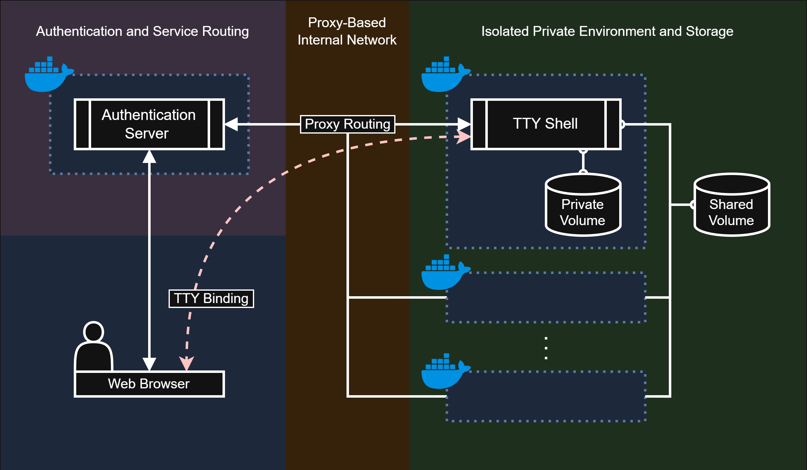
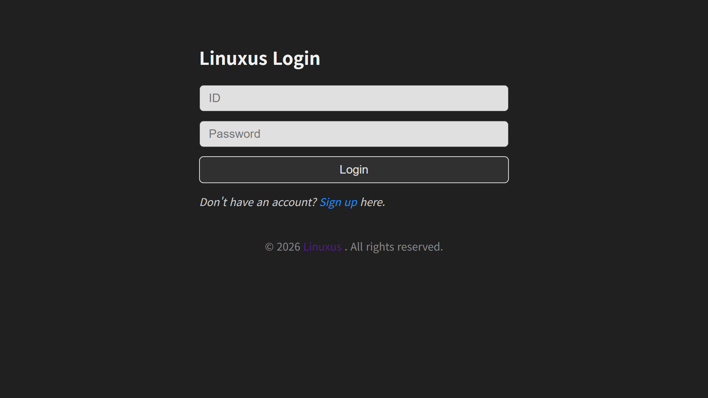
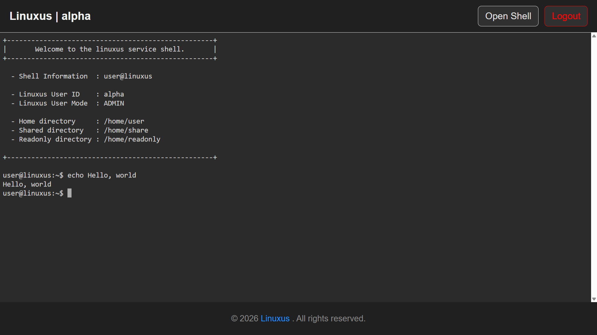
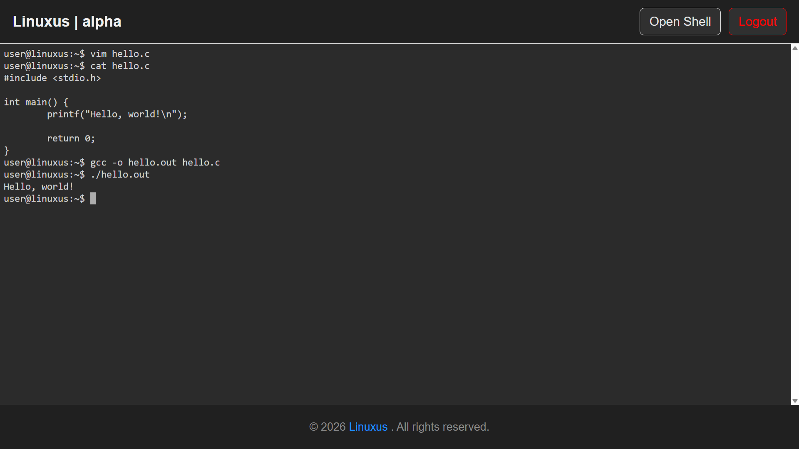

# 🚀 Usage

## 0. Clone Repository

```bash
git clone https://github.com/elecbug/linuxus
cd linuxus
```

---

## 1. Install Dependencies

### Go (build machine only)

```bash
sudo snap install go --classic
```

### Docker

```bash
sudo apt install -y docker-ce docker-ce-cli containerd.io docker-buildx-plugin docker-compose-plugin
```

---

## 2. Build Controller

Build the single Linux executable (Go 1.26.1 or newer):

```bash
./shell/build_ctl.sh
```

The script can be invoked from any working directory. It builds a static Linux
binary for the current architecture; set `GOARCH=arm64` to cross-compile.
`linuxusctl` includes the Auth and Manager service modes, Dockerfiles, user
startup script, and web assets. No Go compiler or source tree is required at runtime.

Generated executable:

```bash
./linuxusctl help
```

For a more convenient CLI experience, enable bash completion support.

Run the following command:

```bash
source ./shell/linuxus-completion.bash
```

After enabling completion, you can use `TAB` to automatically complete commands and options.

---

## 3. Run Service

Copy `linuxusctl` and `cfg/config.yml` into a deployment directory:

```text
linuxus/
├── linuxusctl
├── cfg/
│   └── config.yml
├── data/
│   └── AUTH_LIST
└── volumes/
```

`data/` and `volumes/` are initialized when starting a fresh deployment. All
relative host paths in the YAML are resolved against the directory containing
the executable, even when invoked from another working directory. Absolute
paths remain unchanged. When invoking a symlink to `linuxusctl`, the real
executable's directory is used.

For example, prepare a separate deployment without copying `src/`:

```bash
mkdir -p deploy/cfg
cp linuxusctl deploy/
cp cfg/config.yml deploy/cfg/
sudo ./deploy/linuxusctl up
```

The runtime host needs Linux, a local Docker daemon, `mkfs.ext4` (e2fsprogs),
and `losetup` (util-linux). Disk operations require root privileges. Images use
the executable's architecture. The first image build needs access to the base
images and Ubuntu/Debian package repositories; it does not download Go modules.

Before starting, set the two session secrets in `cfg/config.yml` to your own
values. `up` creates a missing auth file without overwriting existing accounts,
prepares shared disks and registered users' disks, and starts the services.
A fresh auth file has no accounts; `admin_id` designates an account's privileges
and does not create the account automatically.

Host directories can also point to an external storage location through absolute
YAML paths or root-level `data/` and `volumes/` symlinks. Manager passes the
resolved host paths to Docker; it does not need its own copies of the volumes.
The legacy `manager_service.container.{homes_dir,share_dir,readonly_dir}` fields
are retained for configuration compatibility but are no longer mounted into Manager.

### 3.1 Start / Manage Services

```bash
./linuxusctl <OPTION>
```

### ⚙️ Available Options

| Command                           | Description                                                                                      |
| --------------------------------- | ------------------------------------------------------------------------------------------------ |
| `help`                            | Show help message                                                                                |
| `up`                              | Build images and start services                                                                  |
| `down`                            | Stop and remove services                                                                         |
| `restart`                         | Restart services                                                                                 |
| `ps [OPTION]`                     | Show status about linuxus service                                                                |
| `add-user --user <USERNAME>`      | Add a new user                                                                                   |
| `remove-user --user <USERNAME>`   | Remove an existing user                                                                          |
| `clean-volume <OPTION>`           | Remove all user directories if the option is all, otherwise remove specific user directory       |
| `ensure-disk <OPTION>`            | Create a missing user directory if the option is all, otherwise create a specific user directory |

---

### 3.2 Example Usage

```bash
sudo ./linuxusctl up               # Assemble images, prepare disks and start
sudo ./linuxusctl restart          # Restart
./linuxusctl ps network            # Show network status of linuxus service
```

---

## 4. Setup Authentication (Signup-based)

> [!NOTE]
> Linuxus provides a built-in signup system via the web interface.

---

### 4.1 Enable Signup

Edit `cfg/config.yml`:

```yml
auth_service:
  allow_signup: true
```

A **Signup** link will appear on the login page.

---

### 4.2 User Registration Flow

1. User opens the login page
2. Clicks **Signup**
3. Enters ID and password
4. Account is registered

With `volumes.auto-ensure: true`, the first shell access prepares the newly registered user's disk automatically. With the setting omitted or false, initialize new users manually as shown below.

---

### 4.3 Activate User Environment

Enable automatic disk activation in `cfg/config.yml`:

```yaml
volumes:
  auto-ensure: true
```

Apply the setting with `sudo ./linuxusctl restart`. `up` starts the private host
`linuxusctl serve-disks` process; `down` stops it. Manager requests disk preparation
over a Unix socket before creating or restarting a user container. Disk errors
prevent the shell from starting, and existing images are reused rather than
formatted again. Manual `ensure-disk` remains available.

The host process runs with the mounting privileges of `sudo linuxusctl up`.
Its socket has mode 0600 in a mode-0700 `.disk-service` directory beside `AUTH_LIST`.
Only Manager receives that directory as a read-only mount. There is no TCP
listener. Requests accept a registered user ID only; paths and disk limits come
from the deployment configuration. Manager's container capabilities are unchanged.
The default service log is `data/.disk-service/service.log`. Run `sudo ./linuxusctl up`
after a host reboot to restore mounts and the host process; Docker container
restart policies alone do not restart this process. As with the existing deployment,
Docker must run locally on the Linux host.

When `auto-ensure` is omitted or false, users registered after startup need manual
activation:

```bash
sudo ./linuxusctl ensure-disk --user <USERNAME>
```

or initialize all missed user environments:

```bash
sudo ./linuxusctl ensure-disk --all
```

This step:

* Creates home directories
* Mounts volumes
* Activates user accounts

---

### 4.4 Admin Account

* Default admin ID: `alpha`
* Configurable in:

```yml
manager_service:
  admin_id: alpha
```

---

## 5. Volume Structure

```
volumes/
├── homes/
│   ├── alice.img      # ext4 disk image
│   └── alice/         # mounted home
├── share.img
├── share/
├── readonly.img
└── readonly/
```

---

Containers may be removed and recreated while these disk images retain data.
After a host reboot, run `sudo ./linuxusctl up` to remount them before using the
service. `down` removes containers and networks but preserves disks.
`clean-volume` removes data; it stops on unmount or loop-device errors rather
than continuing deletion. Cleaning all volumes leaves unrelated files in the
volume root untouched.

### Migrating an existing source-relative deployment

Existing `src/data` and `src/volumes` are not moved automatically. Before changing
paths, stop the old services and back up `AUTH_LIST` and all disk images.

To keep existing storage in place, configure its absolute host paths in the new
YAML, or link the deployment's `data/` and `volumes/` to those locations. Keep the
storage directories even if you remove the rest of the source checkout.

To relocate storage completely, stop the services, unmount the old user/shared
disks, and detach their loop devices before moving the directories. Copy the
`AUTH_LIST` and `.img` files into the new root's `data/` and `volumes/`, preserving
ownership and permissions. Then run `sudo ./linuxusctl up` to attach and mount
the existing images at the new paths. Do not use `clean-volume` for migration;
it deletes the images and their contents.

---

## 6. Directory Permissions

### 👤 User (`homes/<USER>`)

* Private
* Mounted to `/home/<linux_username>` inside each user container (default: `/home/user`)

### 📂 Share

* RWX for all users
* `/home/share`

### 🔒 Readonly

* Read/execute for users
* Write for admin only
* `/home/readonly`

---

## 🌐 APPENDIX - Preview Image

> 
> Linuxus Architecture Diagram

> 
> Login Page

> 
> Shell Page - Access

> 
> Shell Page - Test GCC
